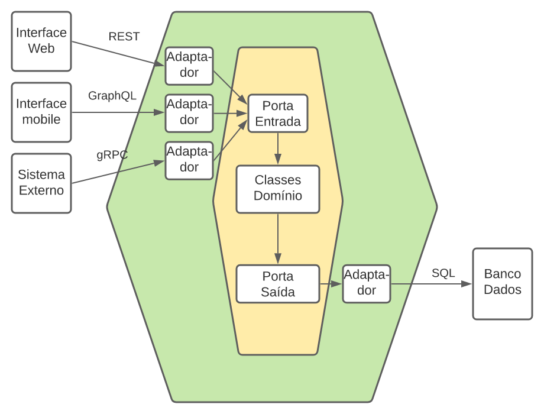

# poc-store-hexagonal-architecture

## **Descrição**

Projeto de testes para implementação de arquitetura hexagonal.

## **Arquitetura**

O projeto foi desenvolvido para utilzar a arquitetura hexagonal.

A arquitetura hexagonal é um estilo de arquitetura de software que se concentra na separação entre o núcleo do software e os componentes externos. O núcleo do software é composto por casos de uso e regras de negócios, enquanto os componentes externos são responsáveis por lidar com as entradas e saídas do sistema. A arquitetura hexagonal é composta por três partes principais: o núcleo do software, as portas e os adaptadores. As portas são interfaces que expõem o núcleo do software para o mundo externo,
enquanto os adaptadores são responsáveis por conectar as portas ao mundo externo.

Com isto foram criados os pacotes principais **adapter** (contendo adaptadore e portas) e **domain** (contendo os casos de uso / regras de negócio).

Imagem ilustrativa

## Stack
- Java 17
- Spring boot
- Spring data JPA
- Postgres
- Gradle
